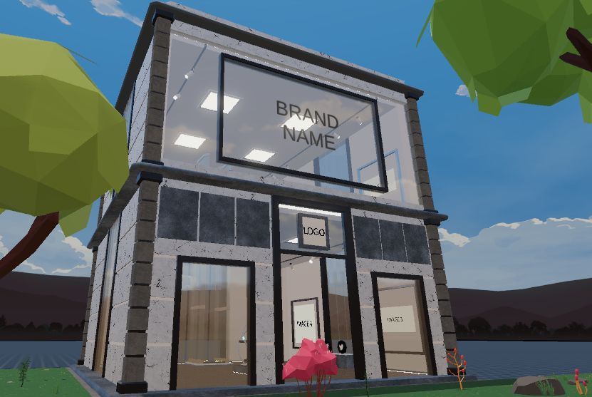

# Museum Template

 A simple generic virtual museum for displaying NFT art




This scene shows you:

- How to add NFT picture frames
- How to add a streaming video
- How to add a POAP booth
- How to add external links
- How to organize the scene's content into neat modular components that are easy to change from a config file


## Try it out

**Install the CLI**

Download and install the Andverse CLI by running the following command:

```bash
npm i -g andverse
```

**Previewing the scene**

Download this example and navigate to its directory, then run:

```
$:  acl start
```

Any dependencies are installed and then the CLI opens the scene in a new browser tab.


## Copyright info

This scene is protected with a standard Apache 2 licence. See the terms and conditions in the [LICENSE](/LICENSE) file.
